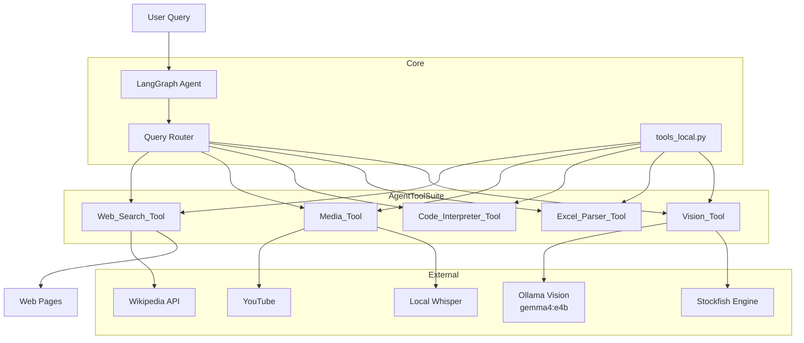
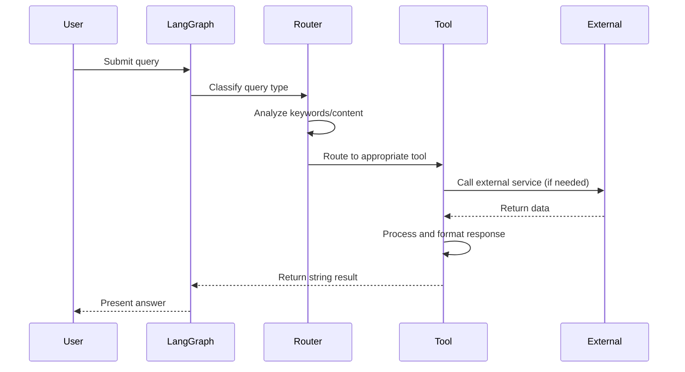
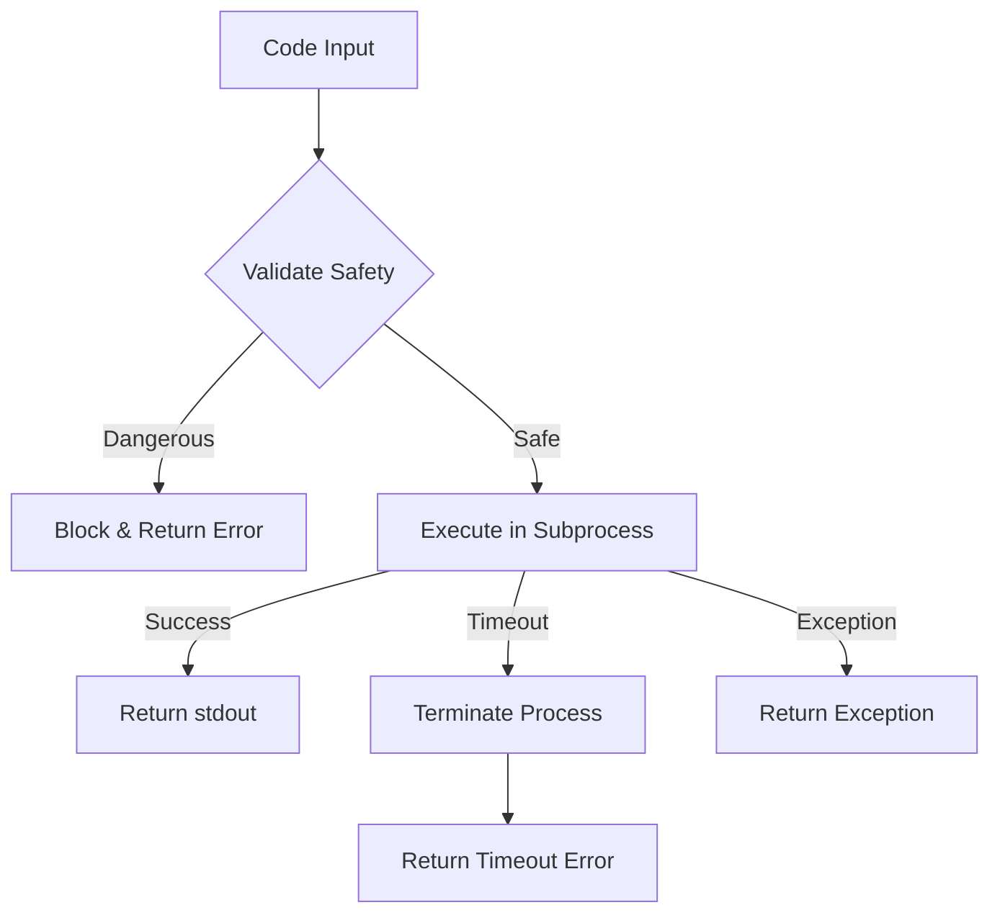
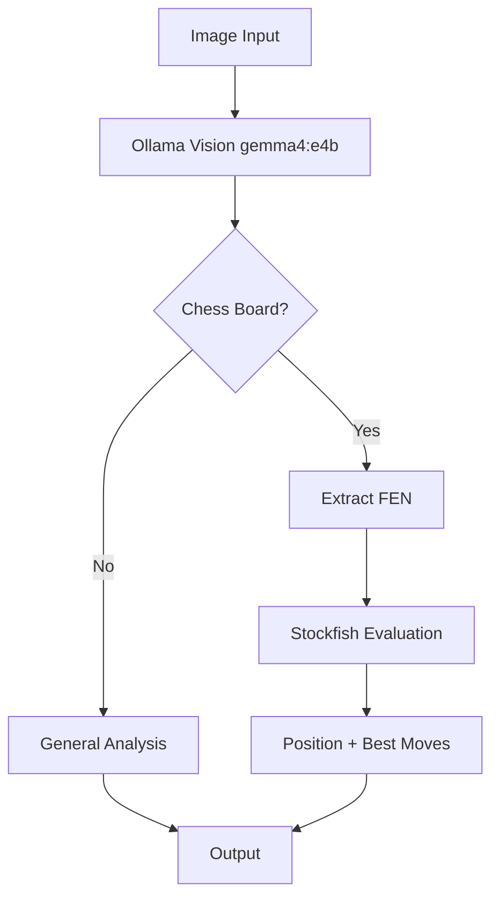
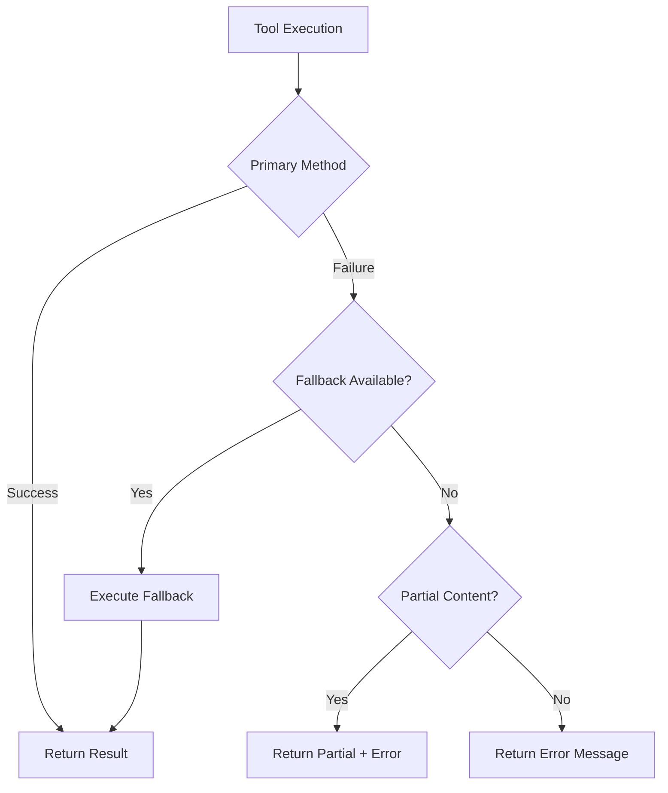

# Design Document: Agent Tool Suite

## Overview

The Agent Tool Suite is a comprehensive extension to the existing LangGraph-based agent system. It provides five integrated tools that enable the agent to handle diverse query types: web search with Wikipedia integration, YouTube video processing and audio transcription, secure Python code execution, document/spreadsheet analysis, and multimodal vision capabilities including chess board evaluation.

### Design Goals

1. **Modularity**: Each tool is self-contained with consistent interfaces, allowing independent development and testing
2. **Security**: The code interpreter uses subprocess isolation with pre-execution security filtering
3. **Extensibility**: Tools can be added or modified without affecting the core agent orchestration
4. **Reliability**: Comprehensive error handling with descriptive messages and graceful degradation
5. **Integration**: Seamless connection to the existing LangGraph agent via the tools_local.py module

### Scope

This design covers:
- Web_Search_Tool: Wikipedia API queries and HTML scraping
- Media_Tool: YouTube transcript extraction and Whisper-based audio transcription
- Code_Interpreter_Tool: Secure Python sandbox execution
- Excel_Parser_Tool: Spreadsheet and document analysis
- Vision_Tool: Image analysis with chess board evaluation support

---

## Architecture

### System Context



### Component Interaction Flow



### Directory Structure

```
Final_Assignment_Template/
├── app.py                    # LangGraph agent (existing)
├── tools_local.py            # Tool implementations (extend)
├── requirements.txt          # Dependencies (update)
├── .env                      # Configuration (existing)
└── .kiro/
    └── specs/
        └── agent-tool-suite/
            ├── requirements.md
            ├── design.md
            └── tasks.md
```

---

## Components and Interfaces

### 1. Web_Search_Tool

**Purpose**: Query Wikipedia API and scrape web content for factual information.

**Interface**:

```python
def wikipedia_search(query: str) -> str:
    """
    Search Wikipedia and return page summary.
    
    Args:
        query: Search term (e.g., "Mercedes Sosa", "1928 Olympics")
    
    Returns:
        Formatted string with Wikipedia page title and summary,
        or "Error: [description]" on failure.
    """

def wikipedia_full_page(page_title: str) -> str:
    """
    Fetch complete Wikipedia page content.
    
    Args:
        page_title: Exact Wikipedia page title
    
    Returns:
        Full page text content, or "Error: [description]" on failure.
    """

def scrape_web_page(url: str) -> str:
    """
    Fetch and parse HTML content from arbitrary URL.
    
    Args:
        url: Valid HTTP/HTTPS URL
    
    Returns:
        Extracted text content from the page,
        or "Error: [description]" on failure.
    """

def web_search_tool(query: str, source: str = "auto") -> str:
    """
    Unified web search interface.
    
    Args:
        query: Search query or URL
        source: "wikipedia", "web", or "auto" (default)
    
    Returns:
        Combined results string with citations.
    """
```

**Key Design Decisions**:

1. **Wikipedia Priority**: Queries containing known topic patterns (historical figures, events, scientific concepts) automatically route to Wikipedia first
2. **Partial Content Recovery**: On error, return any content retrieved before the failure along with the error message
3. **Citation Format**: Include source URLs in format `[Source: URL]` or `Wikipedia (Page Title):`

**Integration with Existing Code**: Extends the existing `_wikipedia_search()` and `_web_search()` functions in tools_local.py with enhanced error handling and full-page support.

---

### 2. Media_Tool

**Purpose**: Extract transcripts from YouTube videos and transcribe audio files.

**Interface**:

```python
def get_youtube_transcript(video_url: str, language: str = "en") -> str:
    """
    Extract transcript from YouTube video.
    
    Args:
        video_url: YouTube video URL or video ID
        language: Preferred language code (default: "en")
    
    Returns:
        Transcript text with timestamps, or "Error: [description]" on failure.
    """

def transcribe_audio(audio_path: str, model_size: str = "base") -> str:
    """
    Transcribe audio file using local openai-whisper library.
    
    Args:
        audio_path: Path to audio file
        model_size: Whisper model size (tiny, base, small, medium, large)
    
    Returns:
        Transcribed text, or "Error: [description]" on failure.
    """

def media_tool(video_url: str = None, audio_path: str = None) -> str:
    """
    Unified media processing interface.
    
    Args:
        video_url: Optional YouTube URL
        audio_path: Optional audio file path
    
    Returns:
        Transcript content, with fallback to audio transcription if needed.
    """
```

**Key Design Decisions**:

1. **Transcript Fallback Chain**: Try youtube_transcript_api first, fall back to audio download + Whisper if unavailable
2. **Language Preference**: When multiple transcripts exist, prefer English, then accept first available
3. **Local Whisper Only**: Use openai-whisper library for local transcription (no API calls required)
4. **Model Selection**: Support multiple Whisper model sizes (tiny, base, small, medium, large) for balancing speed vs accuracy
5. **Supported Audio Formats**: MP3, WAV, M4A, FLAC, OGG (via ffmpeg)

**YouTube URL Pattern Matching**:

```python
YOUTUBE_PATTERNS = [
    r"(?:v=|youtu\.be/)([a-zA-Z0-9_-]{11})",  # Standard and short URLs
    r"youtube\.com/embed/([a-zA-Z0-9_-]{11})",  # Embed URLs
]
```

---

### 3. Code_Interpreter_Tool

**Purpose**: Execute Python code safely in an isolated environment.

**Interface**:

```python
def validate_code_safety(code: str) -> tuple[bool, str]:
    """
    Check code for dangerous operations before execution.
    
    Args:
        code: Python source code to validate
    
    Returns:
        Tuple of (is_safe, error_message).
        If is_safe is False, error_message explains the violation.
    """

def execute_python_code(code: str, timeout: int = 30) -> str:
    """
    Execute Python code in isolated subprocess.
    
    Args:
        code: Python source code to execute
        timeout: Maximum execution time in seconds (default: 30)
    
    Returns:
        stdout output, or "Error: [description]" on failure.
    """

def code_interpreter_tool(code: str, timeout: int = 30) -> str:
    """
    Unified code execution interface with security validation.
    
    Args:
        code: Python source code
        timeout: Execution timeout in seconds
    
    Returns:
        Execution result or error message.
    """
```

**Security Model**:



**Dangerous Operations Detection**:

| Category | Blocked Patterns |
|----------|-----------------|
| File System | `open()`, `os.path`, `shutil`, `pathlib` file operations |
| Network | `socket`, `requests`, `urllib`, `http.client` |
| System | `os.system`, `subprocess`, `eval`, `exec` (nested) |
| Imports | `import os`, `import sys`, `import subprocess` |
| Introspection | `__import__`, `globals()`, `locals()`, `__builtins__` |

**Allowed Standard Library**:

- `math` - Mathematical operations
- `string` - String manipulation
- `collections` - Data structures
- `itertools` - Iteration tools
- `functools` - Functional programming
- `json` - JSON handling (read-only)
- `re` - Regular expressions
- `datetime` - Date/time operations

**Subprocess Isolation**:

```python
import subprocess
import tempfile

def execute_python_code(code: str, timeout: int = 30) -> str:
    # Write code to temporary file
    with tempfile.NamedTemporaryFile(mode='w', suffix='.py', delete=False) as f:
        f.write(code)
        temp_path = f.name
    
    try:
        result = subprocess.run(
            ['python', temp_path],
            capture_output=True,
            text=True,
            timeout=timeout,
            # Security restrictions
            cwd=tempfile.gettempdir(),
            env={'PYTHONDONTWRITEBYTECODE': '1'},  # No .pyc files
        )
        if result.returncode == 0:
            return result.stdout or "Code executed successfully (no output)"
        else:
            return f"Error: {result.stderr}"
    except subprocess.TimeoutExpired:
        return f"Error: Code execution timed out after {timeout} seconds"
    except Exception as e:
        return f"Error: {e}"
    finally:
        os.unlink(temp_path)
```

---

### 4. Excel_Parser_Tool

**Purpose**: Parse and analyze spreadsheet files and documents.

**Interface**:

```python
def parse_excel(file_path: str, sheet_name: str = None) -> str:
    """
    Parse Excel file (.xlsx, .xls) and return data.
    
    Args:
        file_path: Path to Excel file
        sheet_name: Optional specific sheet name
    
    Returns:
        Formatted string representation of data,
        or "Error: [description]" on failure.
    """

def parse_csv(file_path: str, delimiter: str = ",") -> str:
    """
    Parse CSV file and return data.
    
    Args:
        file_path: Path to CSV file
        delimiter: Column delimiter (default: comma)
    
    Returns:
        Formatted string representation of data.
    """

def parse_pdf(file_path: str) -> str:
    """
    Extract text content from PDF file.
    
    Args:
        file_path: Path to PDF file
    
    Returns:
        Extracted text content.
    """

def search_in_data(data: pd.DataFrame, query: str) -> str:
    """
    Search within loaded DataFrame for matching content.
    
    Args:
        data: Pandas DataFrame to search
        query: Search query string
    
    Returns:
        Matching rows formatted as text.
    """

def excel_parser_tool(file_paths: list[str], query: str = None) -> str:
    """
    Unified document parsing interface.
    
    Args:
        file_paths: List of file paths to process
        query: Optional search query within data
    
    Returns:
        Combined analysis results from all files.
    """
```

**Supported Formats**:

| Format | Library | Notes |
|--------|---------|-------|
| `.xlsx` | openpyxl | Primary Excel format |
| `.xls` | xlrd | Legacy Excel format |
| `.csv` | pandas | Standard CSV |
| `.pdf` | PyPDF2 or pdfplumber | Text extraction |

**Data Output Format**:

```
File: example.xlsx
Sheet: Sheet1
Rows: 10, Columns: 5

Column names: Name, Age, City, Score, Date

Sample data (first 5 rows):
| Name | Age | City | Score | Date |
|------|-----|------|-------|------|
| Alice | 30 | NYC | 95.5 | 2024-01-15 |
| Bob | 25 | LA | 88.0 | 2024-01-16 |
...
```

**Partial Failure Handling**:

```python
def excel_parser_tool(file_paths: list[str], query: str = None) -> str:
    results = []
    errors = []
    
    for file_path in file_paths:
        try:
            data = parse_file(file_path)
            if query:
                data = search_in_data(data, query)
            results.append(format_data(file_path, data))
        except Exception as e:
            errors.append(f"Error processing {file_path}: {e}")
    
    output = "\n\n".join(results)
    if errors:
        output += "\n\nErrors:\n" + "\n".join(errors)
    
    return output
```

---

### 5. Vision_Tool

**Purpose**: Analyze images including chess board evaluation.

**Interface**:

```python
def analyze_image(image_path: str, question: str = None) -> str:
    """
    Analyze image using LLM vision model.
    
    Args:
        image_path: Path or URL to image
        question: Optional specific question about the image
    
    Returns:
        Detailed analysis or "Error: [description]" on failure.
    """

def detect_chess_board(image_path: str) -> tuple[bool, str]:
    """
    Detect if image contains a chess board and extract FEN.
    
    Args:
        image_path: Path or URL to image
    
    Returns:
        Tuple of (is_chess, fen_or_empty).
    """

def evaluate_chess_position(fen: str, depth: int = 15) -> str:
    """
    Evaluate chess position using Stockfish.
    
    Args:
        fen: FEN notation of chess position
        depth: Analysis depth (default: 15)
    
    Returns:
        Evaluation and best moves.
    """

def vision_tool(image_path: str, question: str = None) -> str:
    """
    Unified vision analysis interface.
    
    Args:
        image_path: Path or URL to image
        question: Optional question about the image
    
    Returns:
        Analysis result, with chess evaluation if applicable.
    """
```

**Vision Tool Changes - Local Ollama Integration**:

The Vision_Tool has been updated to use only local, free alternatives:

| Previous (Commercial) | Current (Free/Local) |
|----------------------|---------------------|
| GPT-4o API | Ollama with gemma4:e4b |
| Claude 3.5 Sonnet API | Removed |
| Gemini 1.5 Pro API | Removed |
| OpenAI API Key | Not required |
| Anthropic API Key | Not required |
| Google API Key | Not required |

**Audio Transcription Changes**:

| Previous | Current |
|----------|---------|
| OpenAI Whisper API | Local openai-whisper library only |
| use_api parameter | Removed - local only |
| API key required | Not required |

**Vision Model Configuration**:

```python
VISION_CONFIG = {
    "ollama_host": os.getenv("OLLAMA_HOST", "http://localhost:11434"),
    "vision_model": os.getenv("OLLAMA_VISION_MODEL", "gemma4:e4b"),
}
```

**Chess Analysis Flow**:



**Ollama Vision Integration**:

```python
import requests
import base64
import os

def analyze_image(image_path: str, question: str = None) -> str:
    """
    Analyze image using local Ollama vision model (gemma4:e4b).
    
    No API keys required - runs entirely locally.
    """
    ollama_host = os.getenv("OLLAMA_HOST", "http://localhost:11434")
    vision_model = os.getenv("OLLAMA_VISION_MODEL", "gemma4:e4b")
    
    # Read and encode image
    with open(image_path, "rb") as f:
        image_data = base64.b64encode(f.read()).decode("utf-8")
    
    # Build prompt
    prompt = question if question else "Analyze this image and describe what you see in detail."
    
    # Call Ollama API (local)
    response = requests.post(
        f"{ollama_host}/api/generate",
        json={
            "model": vision_model,
            "prompt": prompt,
            "images": [image_data],
            "stream": False
        },
        timeout=60
    )
    
    if response.status_code == 200:
        return response.json().get("response", "No analysis returned")
    else:
        return f"Error: Ollama vision request failed - {response.status_code}"
```

**Stockfish Integration**:

```python
import chess
import chess.engine

def evaluate_chess_position(fen: str, depth: int = 15) -> str:
    board = chess.Board(fen)
    
    with chess.engine.SimpleEngine.popen_uci("stockfish") as engine:
        info = engine.analyse(board, chess.engine.Limit(depth=depth))
        
        score = info["score"].white()
        best_move = info["pv"][0] if "pv" in info else None
        
        evaluation = f"Position: {score}\n"
        if best_move:
            evaluation += f"Best move: {board.san(best_move)}\n"
        
        return evaluation
```

---

## Data Models

### Input Models

```python
from typing import TypedDict, Optional
from enum import Enum

class ToolType(str, Enum):
    WEB_SEARCH = "web_search"
    MEDIA = "media"
    CODE_INTERPRETER = "code_interpreter"
    EXCEL_PARSER = "excel_parser"
    VISION = "vision"

class WebSearchInput(TypedDict):
    query: str
    source: str  # "wikipedia", "web", "auto"

class MediaInput(TypedDict):
    video_url: Optional[str]
    audio_path: Optional[str]
    language: str  # default: "en"
    model_size: str  # Whisper model size: "tiny", "base", "small", "medium", "large"

class CodeInput(TypedDict):
    code: str
    timeout: int  # default: 30

class ExcelInput(TypedDict):
    file_paths: list[str]
    query: Optional[str]
    sheet_name: Optional[str]

class VisionInput(TypedDict):
    image_path: str
    question: Optional[str]
    analyze_chess: bool  # default: True
```

### Output Models

```python
class ToolResult(TypedDict):
    success: bool
    content: str
    error: Optional[str]
    sources: list[str]  # URLs or citations

class WebSearchResult(TypedDict):
    content: str
    page_title: Optional[str]
    url: str

class TranscriptResult(TypedDict):
    transcript: str
    language: str
    video_id: str

class CodeResult(TypedDict):
    stdout: str
    stderr: Optional[str]
    return_code: int
    timed_out: bool

class DataFrameResult(TypedDict):
    shape: tuple[int, int]
    columns: list[str]
    preview: str  # First N rows formatted

class ChessResult(TypedDict):
    fen: str
    evaluation: str
    best_moves: list[str]
```

---

## Correctness Properties

*A property is a characteristic or behavior that should hold true across all valid executions of a system—essentially, a formal statement about what the system should do. Properties serve as the bridge between human-readable specifications and machine-verifiable correctness guarantees.*

### Property 1: Query Classification Accuracy

*For any* query string containing Wikipedia-priority keywords (historical figures, scientific concepts, events), the Web_Search_Tool classification logic SHALL route to Wikipedia as the primary source.

**Validates: Requirements 1.5**

### Property 2: Error Response Format Consistency

*For any* tool and any error condition, the returned string SHALL be prefixed with "Error:" followed by a descriptive message that includes the specific failure reason.

**Validates: Requirements 1.6, 2.4, 8.2**

### Property 3: Language Preference in Transcript Selection

*For any* YouTube video with multiple available transcript languages including English, the Media_Tool SHALL select and return the English transcript.

**Validates: Requirements 2.5**

### Property 4: Code Safety Detection

*For any* Python code containing dangerous operations (file system, network, system calls), the Code_Interpreter_Tool SHALL detect the violation and return a security error before execution begins.

**Validates: Requirements 4.4**

### Property 5: Execution Output Format

*For any* Python code that completes execution successfully, the Code_Interpreter_Tool SHALL return a string containing the stdout output.

**Validates: Requirements 4.2**

### Property 6: Exception Traceback Inclusion

*For any* Python code that raises an exception during execution, the Code_Interpreter_Tool SHALL return a string containing both the exception message and traceback information.

**Validates: Requirements 4.6**

### Property 7: Partial Success in Batch File Processing

*For any* list of input files containing a mix of valid and invalid files, the Excel_Parser_Tool SHALL return successful results for all valid files while including error messages for failed files, without aborting the entire batch.

**Validates: Requirements 5.5**

### Property 8: DataFrame Extraction Correctness

*For any* DataFrame and any valid row/column/cell specification, the Excel_Parser_Tool SHALL return exactly the specified subset of data without modification.

**Validates: Requirements 5.6**

### Property 9: Vision Model Availability

*For any* image analysis request, the Vision_Tool SHALL attempt to connect to the local Ollama endpoint and return a descriptive error if the service is unavailable, including instructions for starting the Ollama service.

**Validates: Requirements 6.5**

### Property 10: Query Routing Correctness

*For any* query classified with a specific type (image, video, website, code, document, general), the LangGraph_Agent router SHALL invoke the corresponding tool.

**Validates: Requirements 7.2**

### Property 11: Tool Error Recovery

*For any* tool execution that returns an error, the LangGraph_Agent SHALL either attempt an alternative tool (if applicable) or return a user-facing error message, never crashing or returning an unhandled exception.

**Validates: Requirements 7.4**

### Property 12: Successful Response Type

*For any* tool that completes successfully, the return value SHALL be a string type containing the result content.

**Validates: Requirements 8.1**

### Property 13: Structured Data Formatting

*For any* tool returning structured data (DataFrames, JSON, lists), the output SHALL be formatted as human-readable text, not raw data serialization.

**Validates: Requirements 8.3**

### Property 14: Citation Inclusion

*For any* tool response that uses external sources (Wikipedia pages, YouTube videos, web URLs), the response SHALL include the source URL or citation in the text.

**Validates: Requirements 8.4**

---

## Error Handling

### Error Response Format

All tools follow a consistent error format:

```
Error: [Tool Name] - [Error Type]: [Description]
```

Examples:
- `Error: Web_Search_Tool - API Error: Wikipedia API returned 503`
- `Error: Media_Tool - Transcription Error: No transcript available for video xyz123`
- `Error: Code_Interpreter_Tool - Security Error: Code contains blocked import 'os'`
- `Error: Vision_Tool - Model Error: Ollama vision model unavailable`

### Error Categories

| Category | HTTP Status Analog | Example Causes |
|----------|-------------------|----------------|
| `API Error` | 5xx | External service failure |
| `Input Error` | 400 | Invalid URL, missing file |
| `Security Error` | 403 | Dangerous code blocked |
| `Timeout Error` | 408 | Execution exceeded limit |
| `Format Error` | 415 | Unsupported file format |
| `Not Found Error` | 404 | Page/video/file not found |

### Graceful Degradation Strategy



### Specific Error Scenarios

**Web_Search_Tool**:
- Wikipedia API 503 → Fall back to DuckDuckGo search
- No results found → Return "No results found for query: X"
- URL fetch fails → Return partial content if any, plus error

**Media_Tool**:
- Transcript unavailable → Attempt audio download + Whisper
- Audio download fails → Return error with supported format list
- Whisper fails → Return error with confidence warning if low quality

**Code_Interpreter_Tool**:
- Security violation → Block immediately, list blocked pattern
- Timeout → Terminate process, return timeout message
- Exception → Return full traceback

**Excel_Parser_Tool**:
- File not found → Skip file, continue batch, report error
- Parse error → Skip file, continue batch, report error
- Empty file → Return "File is empty" message

**Vision_Tool**:
- Ollama service unavailable → Return error with instructions to start Ollama
- Model not found → Return error with instructions to pull the model (e.g., `ollama pull gemma4:e4b`)
- Chess detection fails → Return general image analysis instead

---

## Testing Strategy

### Unit Tests

Unit tests focus on pure logic within each tool:

**Web_Search_Tool**:
- URL pattern validation
- Query keyword classification
- HTML text extraction from sample HTML
- Error message formatting

**Media_Tool**:
- YouTube URL parsing (various formats)
- Language preference selection logic
- Supported format validation

**Code_Interpreter_Tool**:
- Security pattern detection (dangerous operations)
- Output formatting
- Exception message extraction

**Excel_Parser_Tool**:
- File extension detection
- DataFrame formatting logic
- Search query matching

**Vision_Tool**:
- Image URL/path validation
- FEN format validation (regex)
- Model priority selection logic

### Property-Based Tests

Property-based tests use `hypothesis` library with minimum 100 iterations:

```python
from hypothesis import given, strategies as st

# Property 4: Code Safety Detection
@given(st.text())
def test_security_detection(code: str):
    result = validate_code_safety(code)
    # If code contains dangerous patterns, should be blocked
    if any(pattern in code for pattern in DANGEROUS_PATTERNS):
        assert result[0] == False
        assert "Security" in result[1] or "blocked" in result[1].lower()

# Property 7: Partial Success in Batch Processing
@given(st.lists(st.one_of(st.just("valid.xlsx"), st.just("invalid.xyz"))))
def test_batch_processing(file_paths):
    result = excel_parser_tool(file_paths)
    # Should never crash, should mention both successes and errors
    assert isinstance(result, str)
```

### Integration Tests

Integration tests verify actual external service interactions with 1-3 examples:

| Tool | Test Cases |
|------|-----------|
| Web_Search_Tool | Wikipedia API query for "Mercedes Sosa", generic web search |
| Media_Tool | YouTube transcript for known video, audio transcription sample |
| Code_Interpreter_Tool | Execute string reversal, matrix multiplication |
| Excel_Parser_Tool | Parse sample xlsx, csv files; search within data |
| Vision_Tool | General image analysis, chess board evaluation |

### Smoke Tests

Smoke tests verify basic functionality and configuration:

- All tools can be imported from tools_local.py
- requirements.txt contains all dependencies
- Environment variables are accessible (OLLAMA_HOST and OLLAMA_VISION_MODEL optional)
- LangGraph agent initializes with tools available

### Test Configuration

```python
# pytest.ini
[pytest]
testpaths = tests
python_files = test_*.py
python_functions = test_*
markers =
    unit: Unit tests (pure logic)
    property: Property-based tests (hypothesis)
    integration: Integration tests (external services)
    smoke: Smoke tests (configuration)
```

### Coverage Requirements

- Unit tests: 80% code coverage minimum
- All error paths must have at least one test
- Security-critical code paths must have 100% coverage
- Property tests must run minimum 100 iterations each

---

## Security Considerations

### Code Interpreter Sandbox

The Code_Interpreter_Tool is the most security-sensitive component. The design implements defense-in-depth:

**Layer 1: Pre-execution Validation**

```python
DANGEROUS_PATTERNS = [
    r'\bimport\s+os\b',
    r'\bimport\s+sys\b',
    r'\bimport\s+subprocess\b',
    r'\bopen\s*\(',
    r'\bos\.',
    r'\b__import__\b',
    r'\beval\s*\(',
    r'\bexec\s*\(',
    r'\bsocket\b',
    r'\brequests\b',
    r'\burllib\b',
]

def validate_code_safety(code: str) -> tuple[bool, str]:
    for pattern in DANGEROUS_PATTERNS:
        if re.search(pattern, code):
            return False, f"Security: Blocked pattern detected: {pattern}"
    return True, ""
```

**Layer 2: Subprocess Isolation**

- Code runs in a separate process, not the main Python interpreter
- Temporary directory with no access to project files
- Restricted environment variables
- Timeout enforcement prevents infinite loops

**Layer 3: Resource Limits**

```python
import resource

def set_resource_limits():
    # Limit memory to 512MB
    resource.setrlimit(resource.RLIMIT_AS, (512 * 1024 * 1024, 512 * 1024 * 1024))
    # Limit CPU time to 30 seconds
    resource.setrlimit(resource.RLIMIT_CPU, (30, 30))
```

### Ollama Configuration

The Vision_Tool connects to a local Ollama instance for image analysis:

```python
# .env (optional configuration)
OLLAMA_HOST=http://localhost:11434
OLLAMA_VISION_MODEL=gemma4:e4b

# Access in code
import os
from dotenv import load_dotenv

load_dotenv()
ollama_host = os.getenv("OLLAMA_HOST", "http://localhost:11434")
vision_model = os.getenv("OLLAMA_VISION_MODEL", "gemma4:e4b")
```

**Setup Requirements**:
- Install Ollama: https://ollama.ai
- Pull the vision model: `ollama pull gemma4:e4b`
- Ensure Ollama service is running before using Vision_Tool
- **No API keys required** - runs entirely locally

**Environment Variables Summary**:

| Variable | Required | Default | Description |
|----------|----------|---------|-------------|
| `OLLAMA_HOST` | No | `http://localhost:11434` | Ollama service endpoint |
| `OLLAMA_VISION_MODEL` | No | `gemma4:e4b` | Vision model to use |

**Removed Environment Variables** (no longer needed):
- ~~`OPENAI_API_KEY`~~ - Not required
- ~~`ANTHROPIC_API_KEY`~~ - Not required
- ~~`GOOGLE_API_KEY`~~ - Not required

### Input Validation

All tools validate inputs before processing:

| Tool | Validations |
|------|-------------|
| Web_Search_Tool | URL format validation, query sanitization |
| Media_Tool | YouTube URL format, audio file extension |
| Code_Interpreter_Tool | Security pattern scan, syntax check |
| Excel_Parser_Tool | File existence, extension validation |
| Vision_Tool | Image URL format, file existence |

---

## Dependencies

### Required Dependencies

```txt
# requirements.txt additions

# Web Search
beautifulsoup4>=4.12.0
requests>=2.31.0
lxml>=4.9.0

# Media Processing
youtube-transcript-api>=0.6.0
openai-whisper>=20231117  # Local Whisper (no API key required)

# Document Parsing
pandas>=2.0.0
openpyxl>=3.1.0
xlrd>=2.0.0  # Legacy .xls support
PyPDF2>=3.0.0  # PDF text extraction

# Vision & Chess
python-chess>=1.10.0
stockfish>=16.0.0  # Requires Stockfish binary installed
# Vision via local Ollama (no additional Python packages required)
# Uses requests library (already listed above) for HTTP calls to Ollama

# Testing
pytest>=7.0.0
hypothesis>=6.0.0
```

**Note on Removed Dependencies**:
The following commercial API packages have been removed:
- ~~`openai`~~ - Replaced by local Ollama for vision
- ~~`anthropic`~~ - Replaced by local Ollama for vision
- ~~`google-generativeai`~~ - Replaced by local Ollama for vision

All vision processing now uses the local Ollama instance with the `gemma4:e4b` model.

### Optional Dependencies

```txt
# Optional - for enhanced functionality
pdfplumber>=0.10.0  # Better PDF extraction than PyPDF2
pytube>=15.0.0  # YouTube audio download (fallback)
ffmpeg-python>=0.2.0  # Audio format conversion
```

### System Dependencies

- **ffmpeg**: Required by openai-whisper for audio processing
- **Stockfish binary**: Required for chess evaluation
  - Install: `apt-get install stockfish` (Linux) or `brew install stockfish` (macOS)

### Dependency Installation

```bash
# Core dependencies
pip install -r requirements.txt

# System dependencies (Linux)
apt-get install -y ffmpeg stockfish

# System dependencies (macOS)
brew install ffmpeg stockfish

# Ollama setup (required for Vision_Tool)
# Install Ollama from https://ollama.ai
# Then pull the vision model:
ollama pull gemma4:e4b
```

---

## Integration with Existing Code

### Extending tools_local.py

The existing `tools_local.py` contains `_wikipedia_search()` and `_web_search()` functions. These will be extended:

```python
# tools_local.py (extended)

# === Existing functions (preserved) ===
def _wikipedia_search(query: str) -> str:
    # ... existing implementation ...

def _web_search(query: str, max_results: int = 3) -> str:
    # ... existing implementation ...

# === New Web Search Tool functions ===
def wikipedia_full_page(page_title: str) -> str:
    # ... new implementation ...

def scrape_web_page(url: str) -> str:
    # ... new implementation ...

def web_search_tool(query: str, source: str = "auto") -> str:
    # ... unified interface ...

# === Media Tool ===
def get_youtube_transcript(video_url: str, language: str = "en") -> str:
    # ... implementation ...

def transcribe_audio(audio_path: str, model_size: str = "base") -> str:
    # ... implementation ... (local Whisper only, no API option)

def media_tool(video_url: str = None, audio_path: str = None) -> str:
    # ... unified interface ...

# === Code Interpreter Tool ===
def validate_code_safety(code: str) -> tuple[bool, str]:
    # ... implementation ...

def execute_python_code(code: str, timeout: int = 30) -> str:
    # ... implementation ...

def code_interpreter_tool(code: str, timeout: int = 30) -> str:
    # ... unified interface ...

# === Excel Parser Tool ===
def parse_excel(file_path: str, sheet_name: str = None) -> str:
    # ... implementation ...

def parse_csv(file_path: str, delimiter: str = ",") -> str:
    # ... implementation ...

def parse_pdf(file_path: str) -> str:
    # ... implementation ...

def excel_parser_tool(file_paths: list[str], query: str = None) -> str:
    # ... unified interface ...

# === Vision Tool ===
def analyze_image(image_path: str, question: str = None) -> str:
    # ... implementation ...

def evaluate_chess_position(fen: str, depth: int = 15) -> str:
    # ... implementation ...

def vision_tool(image_path: str, question: str = None) -> str:
    # ... unified interface ...
```

### Modifying app.py

The LangGraph agent's `_classify_task()` function will be enhanced to route to the new tools:

```python
# app.py (modified)

def _classify_task(question: str) -> str:
    normalized = question.lower()
    
    # Existing patterns
    if any(kw in normalized for kw in ("image", "photo", "picture", "screenshot")):
        return "vision"
    if any(kw in normalized for kw in ("youtube", "video", "transcript")):
        return "media"
    if any(kw in normalized for kw in ("website", "webpage", "url", "browse")):
        return "web_search"
    
    # New patterns
    if any(kw in normalized for kw in ("execute", "run code", "python", "calculate")):
        return "code_interpreter"
    if any(kw in normalized for kw in ("excel", "spreadsheet", ".xlsx", ".csv", "dataframe")):
        return "excel_parser"
    if any(kw in normalized for kw in ("audio", "transcribe", "mp3", "wav")):
        return "media"
    if any(kw in normalized for kw in ("chess", "board", "fen", "stockfish")):
        return "vision"  # Vision tool handles chess
    
    # Wikipedia priority topics
    wikipedia_topics = [
        "mercedes sosa", "dinosaur", "roy white", "nasa award",
        "kuznetzov", "1928 olympics", "taishō tamai", "malko competition"
    ]
    if any(topic in normalized for topic in wikipedia_topics):
        return "wikipedia"
    
    return "general"
```

The `answer_question()` function will invoke the appropriate tool:

```python
def answer_question(state: AgentState) -> dict[str, str]:
    question = state.get("question", "")
    task_type = state.get("task_type", "general")
    
    # Import tools
    from tools_local import (
        web_search_tool, media_tool, code_interpreter_tool,
        excel_parser_tool, vision_tool
    )
    
    # Route to appropriate tool
    if task_type == "wikipedia":
        answer = web_search_tool(question, source="wikipedia")
    elif task_type == "web_search":
        answer = web_search_tool(question, source="web")
    elif task_type == "media":
        answer = media_tool(extract_media_url(question))
    elif task_type == "code_interpreter":
        answer = code_interpreter_tool(extract_code(question))
    elif task_type == "excel_parser":
        answer = excel_parser_tool(extract_file_paths(question))
    elif task_type == "vision":
        answer = vision_tool(extract_image_url(question), question)
    else:
        answer = web_search_tool(question, source="auto")
    
    return {"answer": answer}
```
